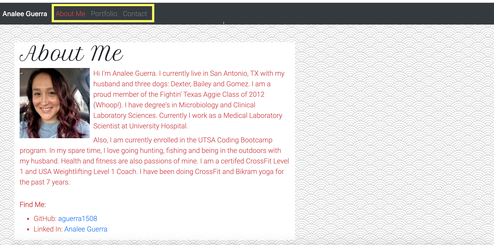
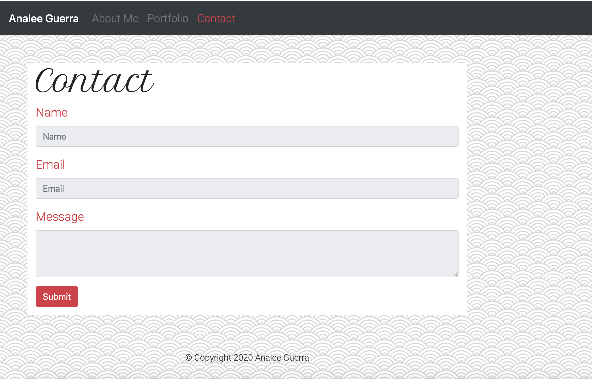

# Analee Guerra's Homework 02 CSS & Bootstrap: Responsive Portfolio

## Description

A mobile responsive potfolio with an "About Me", "Contact" and a "Porfolio" page. The bootstrap grid system was used in combination with media queries in order to obtain a webpage which is responsive for small screens (400px), medium screens (768px) and large screens (992px and above). This activity provided me with addtional knowledge of the use of CSS as well as bootstrap. Worked on ensuring a clean code base by organizing CSS elements to logically flow with the HTML pages and combining of elements when able. Used semantic elements to make the page accessible as well. Learned about and how to use a html validation service to ensure each of the pages created had a valid HTML. 

## Installation

N/A

## Usage 

This page contains a nav bar with links to an "About Me" page, "Contact" page and a "Portfolio" page. These pages can be accessed via the navagation bar links on the top of the page. 

"Contact" form is disabled until better knowledge of how to set up submission of form is gained. 

## Credits

Bootstrap v4.5 - https://getbootstrap.com/docs/4.5/getting-started/introduction/

w3 Schools HTML - https://www.w3schools.com/html/html_intro.asp

w3 Schools CSS - https://www.w3schools.com/css/css_intro.asp

Google Fonts - https://fonts.google.com/

Placeholder - https://placeholder.com/

Hero Patterns - http://www.heropatterns.com/

## License

N/A

## Badges

## Contributing

N/A

## Tests

N/A