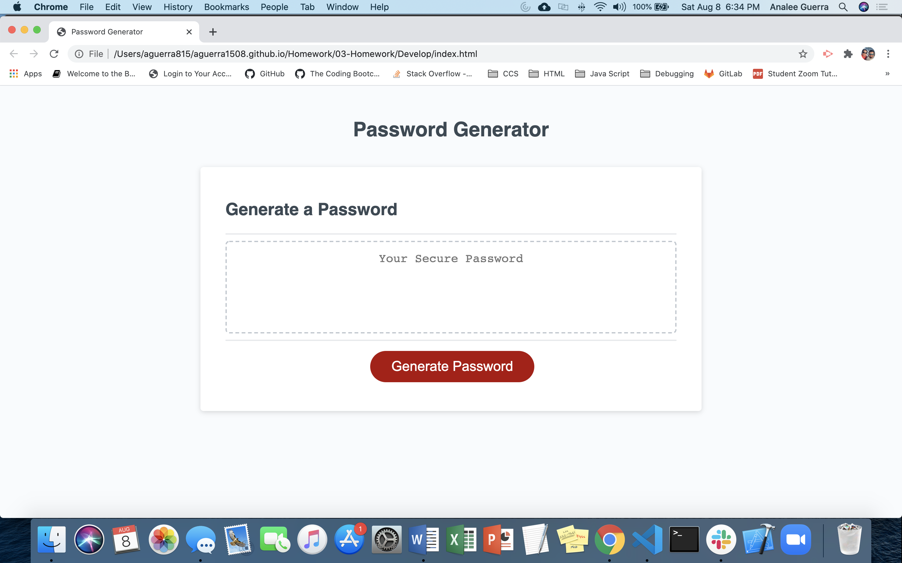

# Analee Guerra's Homework 03 JavaScript: Password Generator

## Description

An application used to generate a random password based on user selected criteria. Randomly generated passwords may provide greater security for sensitive data and information. JavaScript was used to create variables, if/else statements, functions and methods. This exercise provided me with addtional knowledge of JavaScript functionality. 

## Installation

N/A

## Usage 

To use the password generator, first the user must click on the "Generate Password" button.

## Credits

## License

N/A

## Badges

## Contributing

N/A

## Tests

N/A