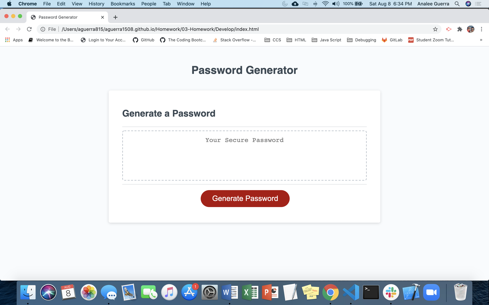
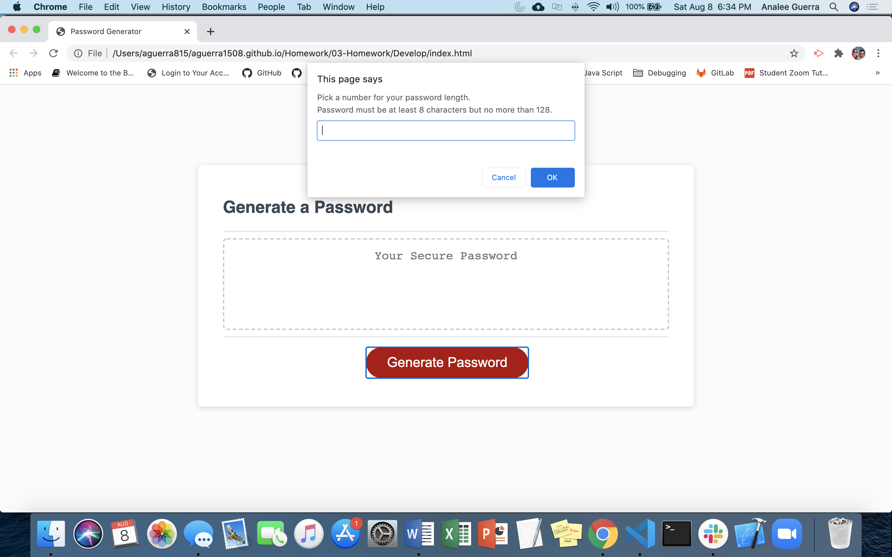
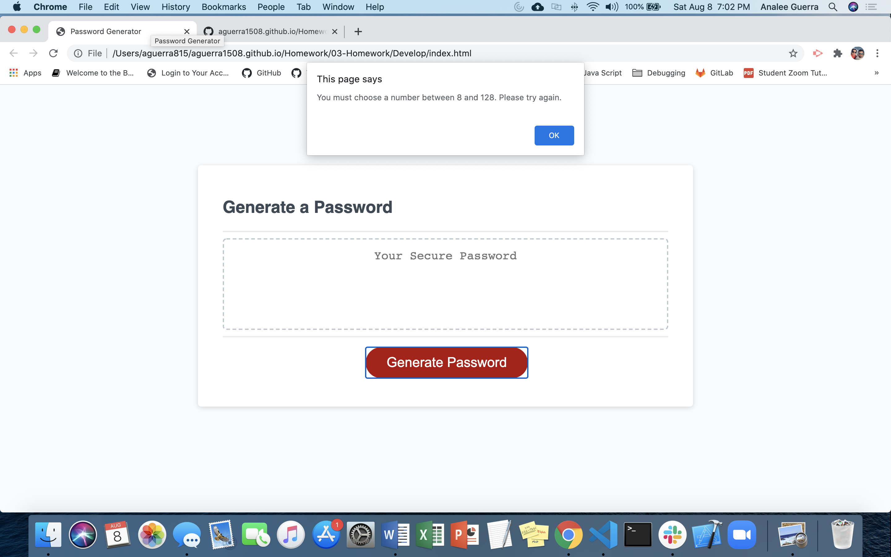
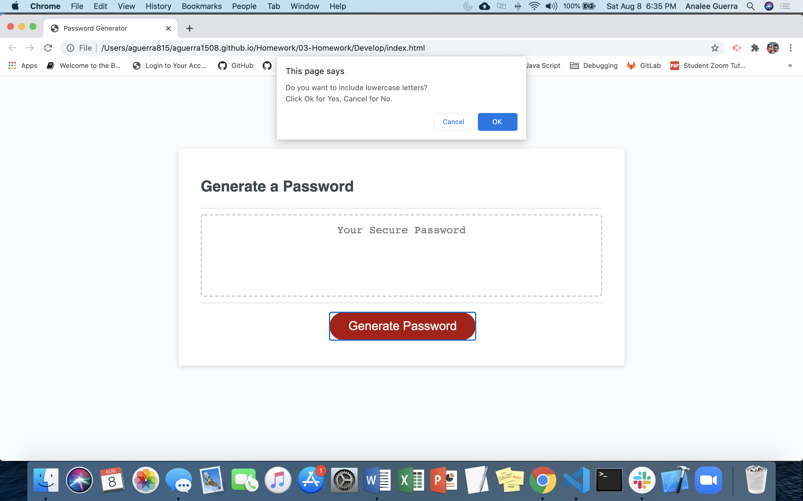
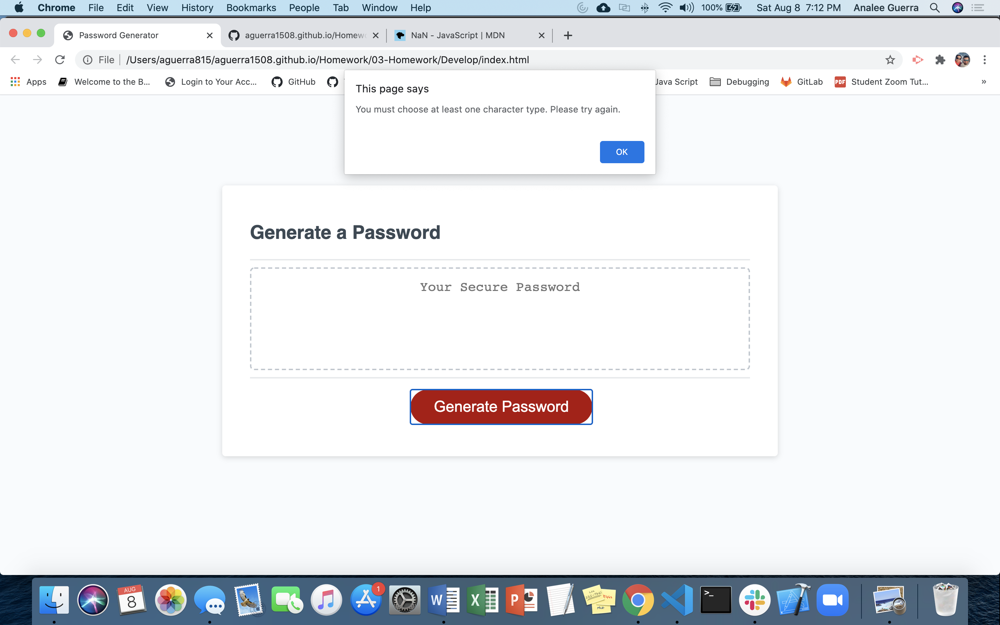
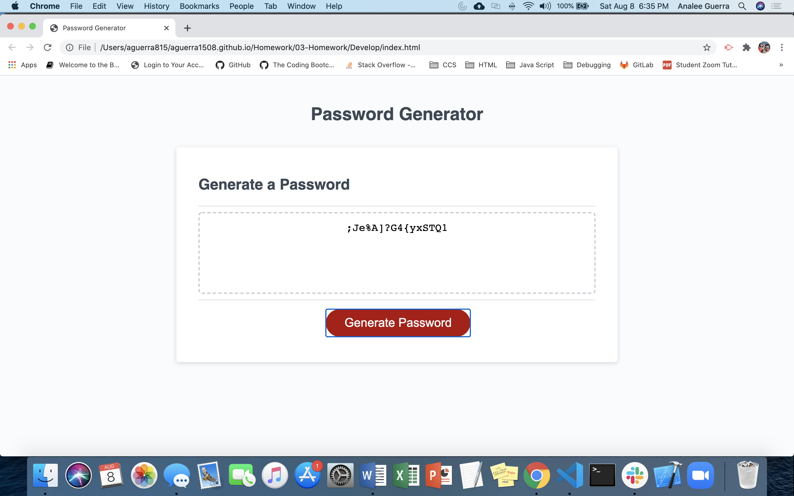

# Analee Guerra's Homework 03 JavaScript: Password Generator

## Description

An application used to generate a random password based on user selected criteria. Randomly generated passwords may provide greater security for sensitive data and information. JavaScript was used to create variables, if/else statements, functions and methods. This exercise provided me with addtional knowledge of JavaScript functionality. 

## Installation

N/A

## Usage 

To use the password generator, first the user must click on the "Generate Password" button.

The user is then prompted to enter a number for their password length. The password length must be a number between 8 and 128.

If the user selects a number which is not between 8 and 128, they will be alerted to try again. They will be returned to the Generate Password screen. 

Once the user has input a valid number, the user will receive a series of confirms. The user will select if they want to add other character types in their password or not.

The user must select at least one character type to include in their password. If no character types are choosen, the user receives an alert to try again and the user is returned to the Generate Password page. 

After the user has made at least one character type selection, a randomly generated password will appear in the Generate Password box.

## Credits

Mozilla JavaScript docs - https://developer.mozilla.org/en-US/docs/Web/JavaScript

w3Schools JavaScript - https://www.w3schools.com/js/js_intro.asp

CodeCademy JavaScript - https://www.codecademy.com/learn/introduction-to-javascript

WDS WebDevSimplified Youtube Channel - https://www.youtube.com/watch?v=iKo9pDKKHnc&t=1467s

## License

N/A

## Badges

## Contributing

N/A

## Tests

N/A